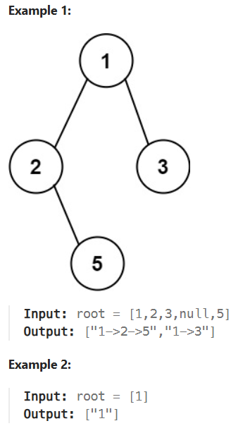

# 257. Binary Tree Paths

_<u>Problem statement</u>_: Given the root of a binary tree, return all root-to-leaf paths in any order.

A leaf is a node with no children.

**Constraints:**

    The number of nodes in the tree is in the range [1, 100].
    -100 <= Node.val <= 100