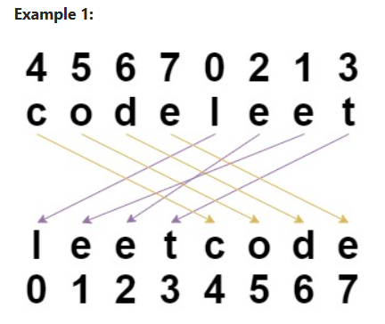

# 1528. Shuffle String

You are given a string s and an integer array indices of the same length. The string s will be **shuffled** such that the character at the ith position moves to indices[i] in the shuffled string.

_<u>Problem statement</u>_: Return the shuffled string.

**Example 1:**
    Input: s = "codeleet", indices = [4,5,6,7,0,2,1,3]
    Output: "leetcode"
    Explanation: As shown, "codeleet" becomes "leetcode" after shuffling.

**Example 2:**
    Input: s = "abc", indices = [0,1,2]
    Output: "abc"

**Constraints:**

    1. s.length == indices.length == n
    2. 1 <= n <= 100
    3. s consists of only lowercase English letters.
    4. 0 <= indices[i] < n
    5. All values of indices are unique.