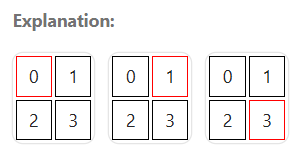
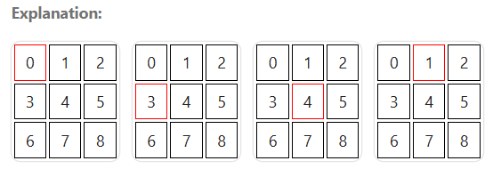

# 3248. Snake in Matrix

There is a snake in an n x n matrix grid and can move in four possible directions. Each cell in the grid is identified by the position: grid[i][j] = (i * n) + j.

The snake starts at cell 0 and follows a sequence of commands.

You are given an integer n representing the size of the grid and an array of strings commands where each command[i] is either "UP", "RIGHT", "DOWN", and "LEFT". It's guaranteed that the snake will remain within the grid boundaries throughout its movement.

_<u>Problem statement</u>_: Return the position of the final cell where the snake ends up after executing commands.

 

**Example 1:**

    Input: n = 2, commands = ["RIGHT","DOWN"]
    Output: 3

**Example 2:**

    Input: n = 3, commands = ["DOWN","RIGHT","UP"]
    Output: 1

 

**Constraints:**

    1. 2 <= n <= 10
    2. 1 <= commands.length <= 100
    3. commands consists only of "UP", "RIGHT", "DOWN", and "LEFT".
    4. The input is generated such the snake will not move outside of the boundaries.