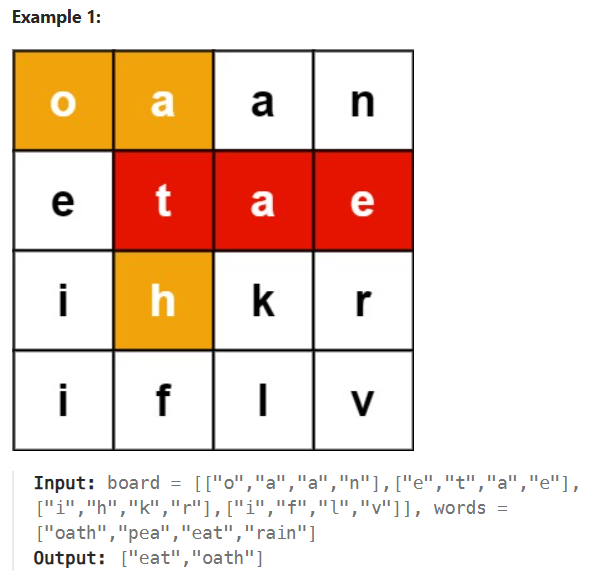
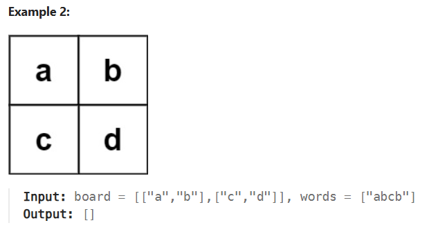

# 212. Word Search II

URL: https://leetcode.com/problems/word-search-ii/description/?envType=problem-list-v2&envId=string

 _<u>Problem statement</u>_: Given an m x n board of characters and a list of strings words, return all words on the board.

Each word must be constructed from letters of sequentially adjacent cells, where adjacent cells are horizontally or vertically neighboring. The same letter cell may not be used more than once in a word.

 

 
**Constraints:**

	1.  m == board.length
	2.  n == board[i].length
	3.  1 <= m, n <= 12
	4.  board[i][j] is a lowercase English letter.
	5.  1 <= words.length <= 3 * 104
	6.  1 <= words[i].length <= 10
	7.  words[i] consists of lowercase English letters.
	8.  All the strings of words are unique.